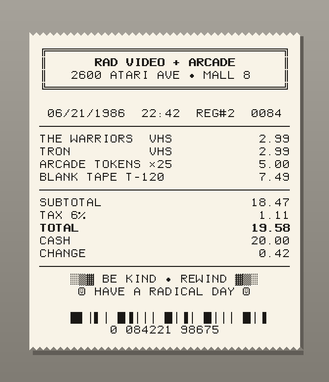
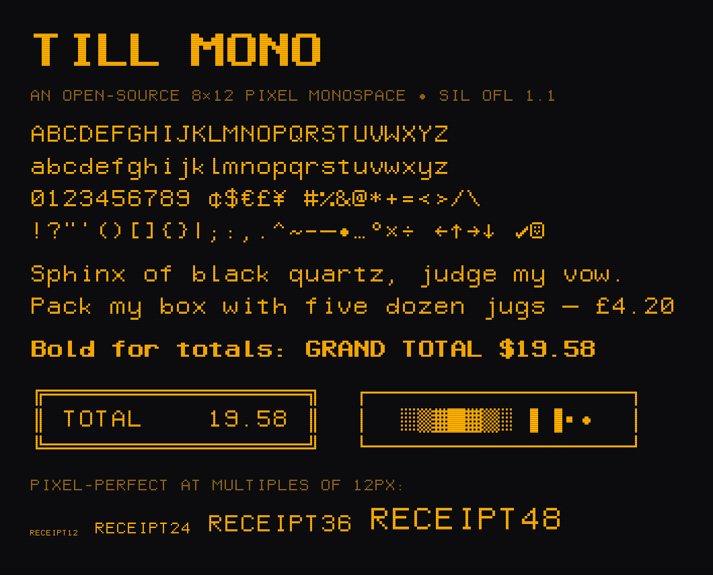
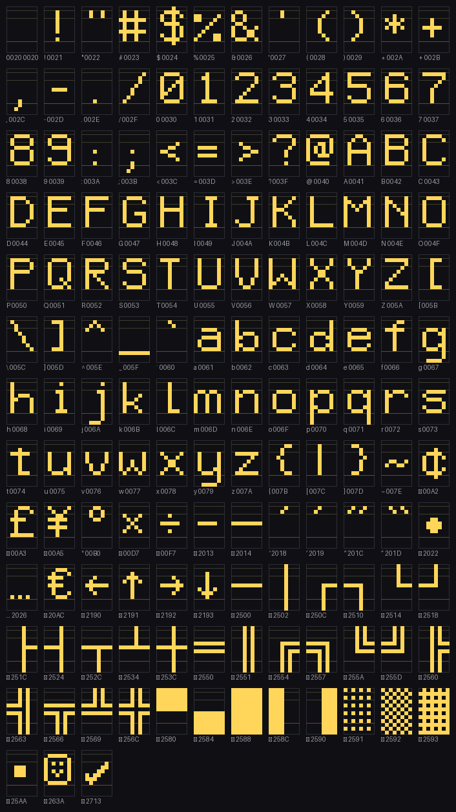
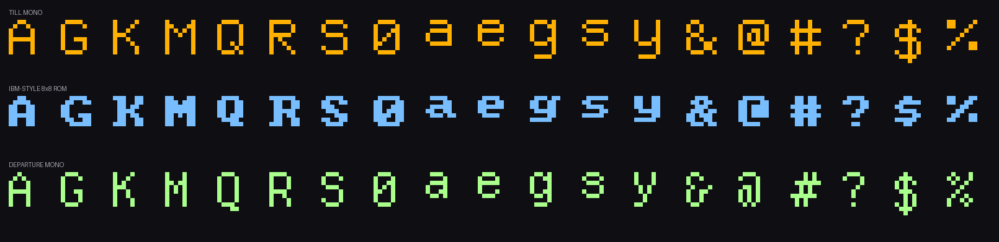

<p align="center">
  
</p>

<h1 align="center">Till Mono</h1>

<p align="center">
  <em>An original open-source 8×12 pixel monospace for 80s-style receipts, labels and terminal UIs.</em><br><br>
  
  
  <br><br>
  <a href="https://thijsvos.github.io/till-mono/"><strong>Live specimen &amp; type tester &rarr;</strong></a>
</p>

Till Mono (a *till* is a cash register) channels the 1980s engineering-terminal
and dot-matrix receipt-printer era. Every glyph is drawn on an 8×12 pixel grid
and compiled to TrueType — squares, no curves, no antialiasing needed at the
right sizes. It ships as installable TTFs, web-ready WOFF2s, and a small Python
pipeline in which every character is an editable ASCII pixel map.



## Features

- **148 glyphs**: full printable ASCII, slashed zero, `¢ £ € ¥ ° × ÷ • – — … ✓ ☺`, arrows `← ↑ → ↓`
- **Single & double box drawing** `─ │ ┌ ┐ └ ┘ ├ ┤ ┬ ┴ ┼` and `═ ║ ╔ ╗ ╚ ╝ ╠ ╣ ╦ ╩ ╬` that connect seamlessly across lines — `╔══╗` frames just work
- **Block & shade elements** `█ ▀ ▄ ▌ ▐ ░ ▒ ▓ ▪` for dividers, dithered banners and fake barcodes
- **Bold** weight for totals and headers, generated from the same pixel maps
- **Pixel-perfect** at font sizes that are multiples of 12 px (12 / 24 / 36 / 48…)
- Fully **monospaced** (8 px advance), so classic space-padding layout works

## Install

Grab the TTFs from the **[latest release](https://github.com/thijsvos/till-mono/releases/latest)**
— or straight from [`fonts/ttf/`](fonts/ttf) — and install them like any other
font: double-click → Install. Then select **Till Mono** in your app.

**macOS: if "Till Mono" doesn't appear after installing**, the download is
quarantined. Safari/Chrome tag downloaded files with `com.apple.quarantine`, and
Font Book copies the tag into `~/Library/Fonts/` — the font installs, reports
`valid=yes`, and is still skipped by the font registry, so it never shows up in
any font picker. Clear it:

```sh
xattr -d com.apple.quarantine ~/Library/Fonts/TillMono-*.ttf
```

The font appears within a few seconds; no logout or cache reset needed. This is a
macOS download-security behaviour, not a problem with the font.

Release assets carry [build provenance](https://docs.github.com/actions/security-guides/using-artifact-attestations),
so you can verify a download really came from this repo's CI:

```sh
gh attestation verify TillMono-Regular.ttf --repo thijsvos/till-mono
```

(v1.0.0 predates attestation; v1.0.1 and later carry it.)

## Use on the web

Copy [`fonts/webfonts/`](fonts/webfonts) into your project:

```css
@font-face {
  font-family: "Till Mono";
  src: url("./TillMono-Regular.woff2") format("woff2");
  font-weight: 400;
}
@font-face {
  font-family: "Till Mono";
  src: url("./TillMono-Bold.woff2") format("woff2");
  font-weight: 700;
}

.receipt {
  font-family: "Till Mono", monospace;
  font-size: 24px;      /* multiples of 12px render pixel-perfect */
  line-height: 1;       /* makes │ ║ █ connect vertically */
}
```

Or hotlink via jsDelivr, pinned to a release tag — no install, no build step:

```css
src: url("https://cdn.jsdelivr.net/gh/thijsvos/till-mono@v1.0.3/fonts/webfonts/TillMono-Regular.woff2") format("woff2");
```

You can also depend on it from another project directly:

```sh
npm install github:thijsvos/till-mono   # fonts land in node_modules/till-mono/fonts
git submodule add https://github.com/thijsvos/till-mono vendor/till-mono
```

A live specimen with an interactive type tester is at
**[thijsvos.github.io/till-mono](https://thijsvos.github.io/till-mono/)**
(source: [`docs/index.html`](docs/index.html)).

## Receipt & label printing

- Most label printers (Dymo, Brother, Zebra…) expose a normal font picker
  through their driver — just choose Till Mono. Thermal heads are ~203 dpi;
  sizes around **8.7 pt (24 px)** or **13 pt (36 px)** map cleanly to printer
  dots.
- Driving an ESC/POS receipt printer directly? Render your text to a 1-bit
  bitmap with this font (Python + Pillow works great) and send it as a raster
  image — that is the standard way to get custom fonts onto those printers,
  and a pixel font is ideal for it.
- Lay out the classic way: pad columns with spaces (58 mm paper ≈ 32 chars,
  80 mm ≈ 48 chars at 24 px) and rule sections with `─` or `═`.

## Build from source

```sh
python3 -m venv .venv && . .venv/bin/activate
pip install --require-hashes -r requirements.txt   # CI builds on Python 3.14

# Pins the font's internal timestamp so rebuilds are byte-identical.
# CI uses this exact value — build without it and your fonts will look "changed".
export SOURCE_DATE_EPOCH=1787097600

python src/build_till_mono.py    # writes fonts/ttf/, fonts/webfonts/, docs/fonts/
python src/proof.py              # renders a contact sheet of every glyph
python src/render_previews.py    # renders the specimen + receipt images
```

The built fonts are committed to the repo, and CI rebuilds on every push and
fails if they differ from source — so a glyph edit has to be committed together
with its rebuilt fonts.

## Edit a glyph

Every character lives in [`src/build_till_mono.py`](src/build_till_mono.py)
as a little ASCII bitmap — `X` is a pixel, `.` is empty, and the number is the
top row (0–11, baseline under row 8):

```python
G['A'] = (1, ["..XX..",
              ".X..X.",
              "X....X",
              "X....X",
              "XXXXXX",
              "X....X",
              "X....X",
              "X....X"])
```

Flip some pixels, rebuild, done. Bold is generated automatically by
thickening strokes one pixel. The full character map:



## Originality & verification

Every outline here is original: each glyph was typed by hand as the ASCII art
you see in the build script and traced to outlines by code in the same file —
no font was ever opened, traced, or converted.

Because pixel grids force convergent solutions, [`src/compare.py`](src/compare.py)
diffs every glyph bitmap against the two closest relatives — and **runs on every
push**, failing CI if any glyph becomes byte-identical to a reference outside a
small allow-list of single-solution shapes. Current results:

| Reference | Shared glyphs | Identical bitmaps |
|---|---|---|
| font8x8 (IBM-style 8×8 ROM) | 94 | 1 — `_` |
| Departure Mono | 144 | 12 — ``! * + , = T ` × ÷ – ┌ ╔`` |

**No letter or digit matches either reference.** Every collision is a shape with
essentially one sensible solution on an 8×12 grid — a rule, a cross, the obvious
box corners — which is what any two pixel fonts converge on.



## License

Till Mono is licensed under the [SIL Open Font License 1.1](OFL.txt) — free
for commercial use, embedding, bundling, modification and redistribution.
No Reserved Font Name is declared, but if you fork it into something new,
picking a new name keeps things unconfusing: change `FAMILY` in
`src/build_till_mono.py` and rebuild.
